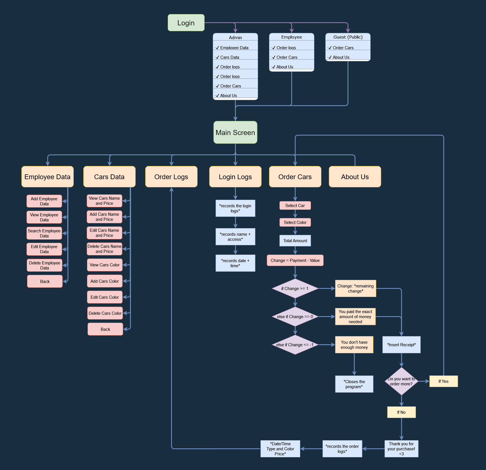
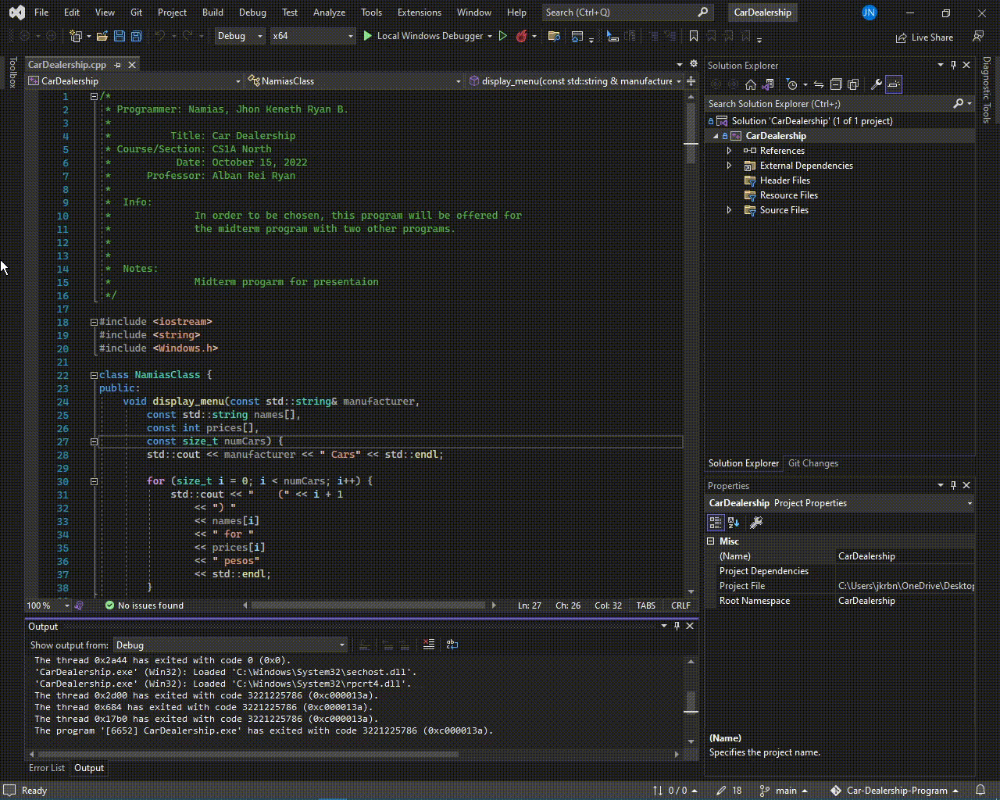

# Car Dealership Management Program
This project, which is a topic of the Fundamentals of Programming course, involves creating a car dealership management entirely in C++. We are pleased to announce the release of a convenient console application for performing management system tasks like adding new car(s) to a data set, modifying and deleting car(s) from a data set, exporting order logs, etc.

### Programmer: Jhon Keneth Ryan B. Namias

### Title: Car Dealership Management Program

### Course/Section: CS1A North

### Date: December 16, 2022

### Professor: Alban Ryan Rei

## Features
Planned (✘) and currently working (✓) - but not necessarily fully completed - features:

### Admin
  - ✓ Edit Employee Data
      * ✓ Add Employee Data
      * ✓ Display Employee Data
      * ✓ Search Employee Data
      * ✓ Edit Employee Data
      * ✓ Delete Employee Data
  >
  - ✓ Cars Data
      * ✓ View Cars Name & Price
      * ✓ Add Cars Name & Price
      * ✓ Edit Cars Name & Price
      * ✓ Delete Cars Name & Price
      * ✓ View Cars Color
      * ✓ Add Cars Color
      * ✓ Edit Cars Color
      * ✓ Delete Cars Color
  >
  - ✓ Order Logs
      * ✓ Date
      * ✓ Time 
      * ✓ Car Name 
      * ✓ Car Color 
      * ✓ Car Price 
  >
  - ✓ Order Cars
      * ✓ Cars Name & Price
      * ✓ Cars Colors
      * ✓ Cashier
      * ✓ All logic corrected
  >
  - ✓ About Us

### Employee
  - ✓ Order Logs
      * ✓ Date
      * ✓ Time 
      * ✓ Car Name 
      * ✓ Car Color 
      * ✓ Car Price 
  >
  - ✓ Order Cars
      * ✓ Cars Name & Price
      * ✓ Cars Colors
      * ✓ Cashier
      * ✓ All logic corrected
  >
  - ✓ About Us

  ### Guest (Public)
  - ✓ Order Cars
      * ✓ Cars Name & Price
      * ✓ Cars Colors
      * ✓ Cashier
      * ✓ All logic corrected
  >
  - ✓ About Us

## Flowchart

## Programming Paradigms & Principles Used
  * Object-Oriented Programming
  * Code Reusability
  * Procedural Programming
  * File Handling

## How to Use
The user must first log in; if they do not already have an account, they can utilize the 'Guest' or public entry option.
Once in the Main, all users may proceed to order Toyota cars.
However, only those with admin level access may view the order logs and edit a car's data. Administrators must answer for their conduct. 

## Login Information
### Admin
|      Username      |      Password     |
| -----------------  | ----------------- |  
|       Namias       |       Namias      |

### Employee
|      Username      |      Password     |
| ------------------ | ----------------- |  
|        Miku        |        Miku       |

## How to Run

### Requirements 🧾
- Download and Install Microsft Visual Studio 2019 or higher version.
- Download and Install MinGW driver

### Setup 🖥️
1. Clone the repository or Download and Extract the source code zip file.
2. Open the extracted file and open "CarDealership.exe" 
3. That's it. 

## Limitation 
- No GUI interface
- Can only take 1 order at a time
- Can't display product images

> Note: Some issues were not yet fixed thus I will be updating this in several upcoming weeks/months. And I hope that this project will be used for educational purposes and that the system itself maintains its copyrights as proposed.

Enjoy :)

## Screenshots

<table>
  <tr>
    <th colspan="1" align="center">1. Title Page</th>
  </tr>
  <tr>
    <td></td>
  </tr>
</table>

<table>
  <tr>
    <th colspan="1" align="center">2. Login Page</th>
  </tr>
  <tr>
    <td></td>
  </tr>
</table>

<table>
  <tr>
    <th align="center">3. Admin Login</th>
    <th align="center">4. Employee Login</th>
  </tr><tr>
     <td></td>
    <td></td>
  </tr>
</table>

<table>
  <tr>
    <th align="center">5. Admin Menu</th>
    <th align="center">6. Employee Menu</th>
  </tr>
  <tr>
    <td></td>
    <td></td>
  </tr>
</table>

<table>
  <tr>
    <th align="center">7. Employee Data</th>
    <th align="center">8. Add Employee Data</th>
  </tr>
  <tr>
    <td></td>
    <td></td>
  </tr>
  <tr>
    <th align="center">9. View Employee Data</th>
    <th align="center">10. Search Employee Data</th>
  </tr>
  <tr>
    <td></td>
    <td></td>
  </tr>
  <tr>
    <th align="center">11. Edit Employee Data</th>
    <th align="center">12. Delete Employee Data</th>
  </tr>
  <tr>
    <td></td>
    <td></td>
  </tr>
</table>

<table>
  <tr>
    <th colspan="1" align="center">13. Cars Data</th>
  </tr>
  <tr>
    <td></td>
  </tr>
</table>

<table>
  <tr>
    <th align="center">14. View Cars Name & Price</th>
    <th align="center">15. Add Cars Name & Price</th>
  </tr>
  <tr>
    <td></td>
    <td></td>
  </tr>
   <tr>
    <th align="center">16. Edit Cars Name & Price</th>
    <th align="center">17. Delete Cars Name & Price</th>
  </tr>
  <tr>
    <td></td>
    <td></td>
  </tr>
   <tr>
    <th align="center">18. View Cars Color</th>
    <th align="center">19. Add Cars Color</th>
  </tr>
  <tr>
    <td></td>
    <td></td>
  </tr>
   <tr>
    <th align="center">20. Edit Cars Color</th>
    <th align="center">21. Delete Cars Color</th>
  </tr>
  <tr>
    <td></td>
    <td></td>
  </tr>
</table>

<table>
  <tr>
    <th align="center">22. Order Logs</th>
  </tr>
  <tr>
    <td></td>
  </tr>
</table>

<table>
  <tr>
    <th align="center">23. Login Logs</th>
  </tr>
  <tr>
    <td></td>
  </tr>
</table>

<table>
  <tr>
    <th align="center">24. Order Cars</th>
  </tr>
  <tr>
    <td></td>
  </tr>
  <tr>
    <th align="center">25. Order Car Color</th>
  </tr>
  <tr>
    <td></td>
  </tr>
  <tr>
    <th align="center">26. Cashier</th>
  </tr>
  <tr>
    <td></td>
  </tr>
  <tr>
    <th align="center">27. Receipt</th>
  </tr>
  <tr>
    <td></td>
  </tr>
</table>

<table>
  <tr>
    <th align="center">28. About Us</th>
  </tr>
  <tr>
    <td></td>
  </tr>
</table>

<table>
  <tr>
    <th align="center">29. Loading Screen</th>
  </tr>
  <tr>
    <td></td>
  </tr>
</table>
